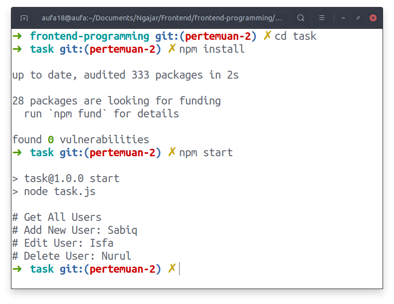
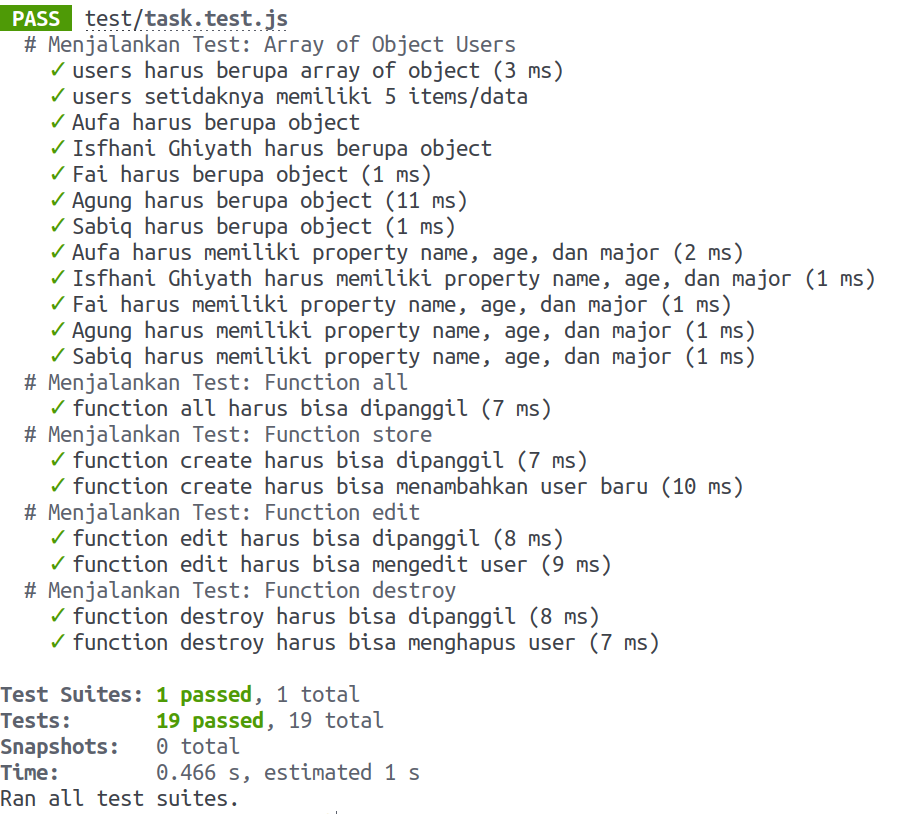

# Task Pertemuan 2

## Deskripsi Task

- Mengelola struktur data (data structure and algorithm) array dan object.
- Membiasakan sintaks JavaScript Modern (ES6).
- Membiasakan melakukan TDD (Test Driven Development).

## Menjalankan Task:

- Masuk ke folder task: `cd task`.
- Install dependencies: `npm install`.
- Test task: `npm test`.
- Jalankan task: `node task.js` atau `npm start`.

**Install Task:**

## Test Task:

- Task harus lolos semua test.
- Test task: `npm test`.
- Folder `test` dan isinya jangan dihapus.

**Test Berhasil:**

## Ketentuan Pengumpulan:

- Push task ke Repository Github.
- Submit link repository ke Elena.
- Tugas tidak perlu dizip.
- Folder `node_modules` tidak perlu diupload.
- Submit task sesuai kelas:
  - Kamis: 03 Maret 2022, [Link Elena](https://elena.nurulfikri.ac.id/mod/assign/view.php?id=24689)
  - Jumat: 05 Maret 2022, [Link Elena](https://elena.nurulfikri.ac.id/mod/assign/view.php?id=25572)
